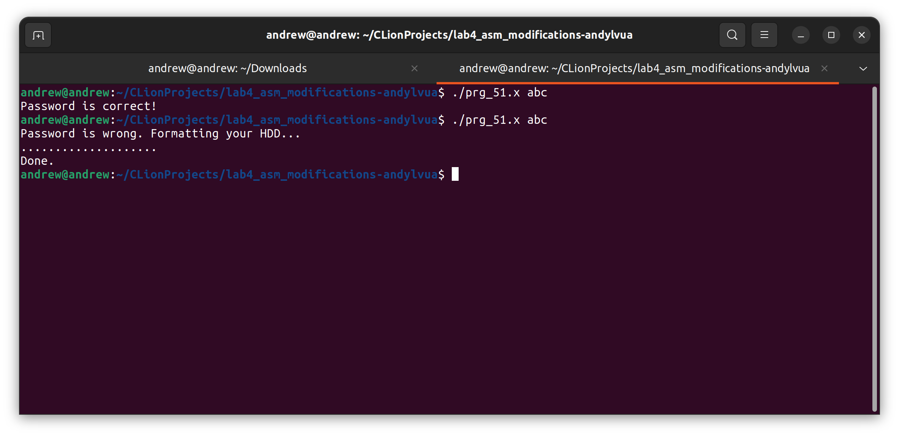

# Lab 4. Binary file modification
> Author: Andrii Yaroshevych
>
> Variant: `51` The program accepts a password from the command line. Make it accept any password other than the one that was correct before modification.
>
> OS: Linux

## Prerequisites

* Linux operating system

## Tool used

* `cutter` - https://cutter.re/

### How to install

1. Download the latest version of cutter for Linux from https://cutter.re/
2. Add execution permissions to the downloaded file

    ```bash
    chmod +x Cutter*.AppImage
    ```

3. Run the file

    ```bash
    ./Cutter*.AppImage
    ```

   > **Note**
   >
   > If you see the following error:
   > ```text
    > dlopen(): error loading libfuse.so.2
    >
    > AppImages require FUSE to run.
    > ```
   >
   > Please install `fuse` package with the following command and try again:
   >
   > ```bash
    > sudo apt-get install fuse libfuse2
    > ```

## Workflow

1. Run `cutter` and open the binary file `prg_51.x` from the root folder of the repository

   
2. Go to the `Disassembly` tab and find main function

   

    <br>

   **Let's examine the code of the main function**

    ```asm
    ; arg int argc @ rdi
    ; arg char **argv @ rsi
    ```

   We see that password passed as a command line argument will be passed in `rsi` register.

   
   <br>
   <br>
   We then see that content of `rsi` register is passed to the `rax` register.
   <br>
   <br>
   **Further examination**:
   
   <br>
   <br>
   Here we see that something is loaded from the memory address `0x2022` and stored in the `rsi` register. Then, the content of `rax` register, where entered password is stored, is moved to the `rdi` register.
   <br>
   <br>
   Then, the `strcmp` function is called. This function compares two strings and returns `0` to the `eax` register if strings are equal.
   <br>
   <br>
   Let's take a look on what is going on later:
   

   We see that the `eax` register is compared with `0`. `jne` instruction means that if the content of `eax` register is not equal to `0`, the program will jump to the address `0x1258`. If the content of `eax` register is equal to `0`, the program will say that password is correct, jump to the address `0x12b5`, and leave.

3. From the observation above, we can conclude that the password is stored in the memory address `0x2022`. Let's go to the `Hexdump` tab and find this address.

   

   On this screenshot, we can see that address `0x2022` contains a simple c-string `abc`.
   <br>
   <br>
   Indeed, if we try to run the program with the password `abc`, we will see that the program says that the password is correct.

   

4. Let's make the program accept any password other than the one that was correct before modification.
   <br>
   <br>
   Go back to the `Disassembly` tab and find `jump` instruction after the `strcmp` function call.

   
   <br>
   <br>
   We see that the program jumps only if the password is incorrect. Let's change the `jne` instruction to `je` instruction. This will make the program jump if the password is correct.
   <br>
   <br>
   Knowing that `jne` instruction is located at the address `0x1248`, go to the `Hexdump` tab again and find this address:
   
   <br>
   <br>
   
   <br>
   <br>
   Now we know, that `jne` instruction has the opcode `75`. Let's find the opcode of `je` instruction for replacement - [http://www.mathemainzel.info/](http://www.mathemainzel.info/files/x86asmref.html#je).

   
   <br>
   <br>
   We see that `je` instruction has the opcode `74`. Let's replace `75` with `74` in the `Hexdump` tab:
   > **Note**
   >
   > Reopen the file in write mode if needed

   
   <br>
   <br>

   

5. Check the results

   Now, try to run the program with the password `abc`:
   
   <br>
   Oooh, crap! This was scary)
   <br>
   <br>
   Anyway, we see that the program says that the password is incorrect. Let's try to run the program with some different passwords to see if it actually works as expected:
   
   So, it works correctly.

## Usage

Run the unmodified program with the password `abc`:
```bash
./prg_51.x abc
```

or try to run it with any other password.

To make sure my solution works, you can run the modified program with some random password:
```bash
./prg_51_modified.x 123
```

or try to run it with password `abc`.

## License
The [MIT](https://choosealicense.com/licenses/mit/) License (MIT)

Copyright © 2022. Andrii Yaroshevych
